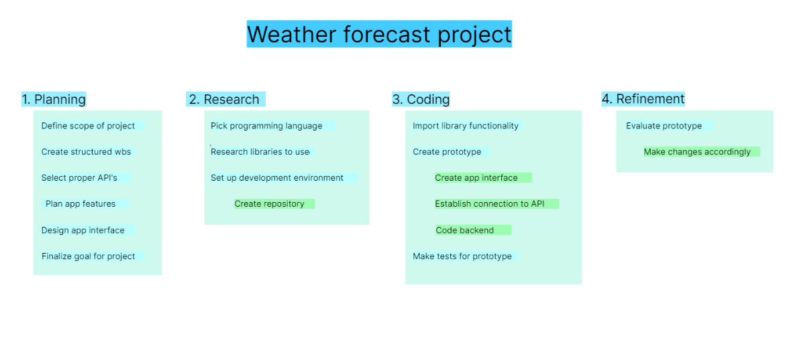
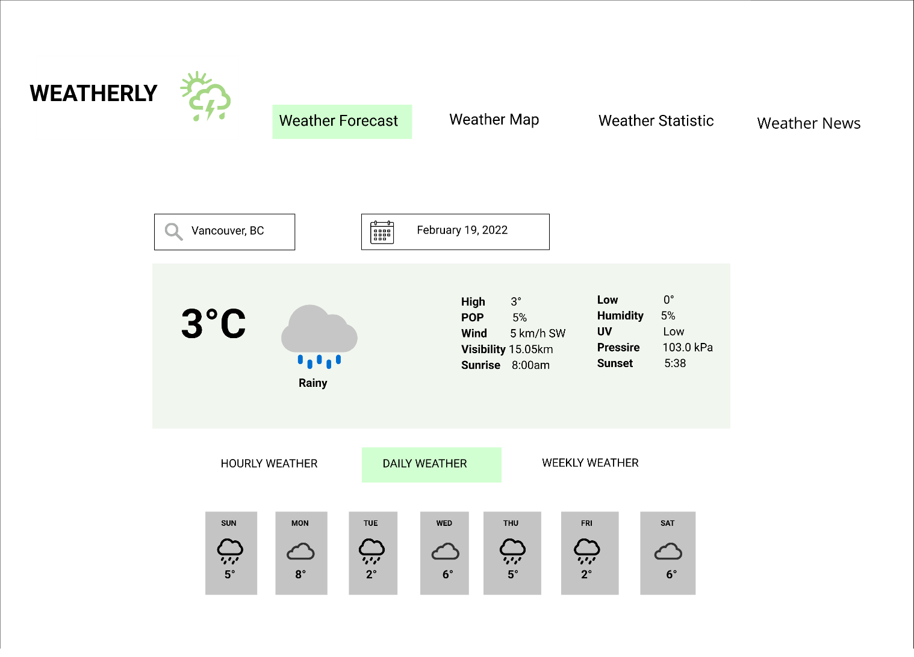
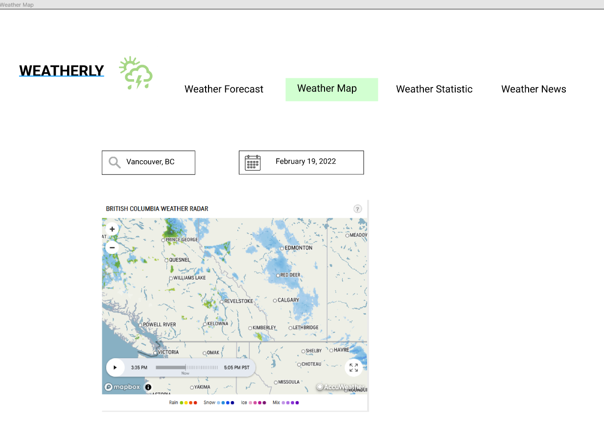
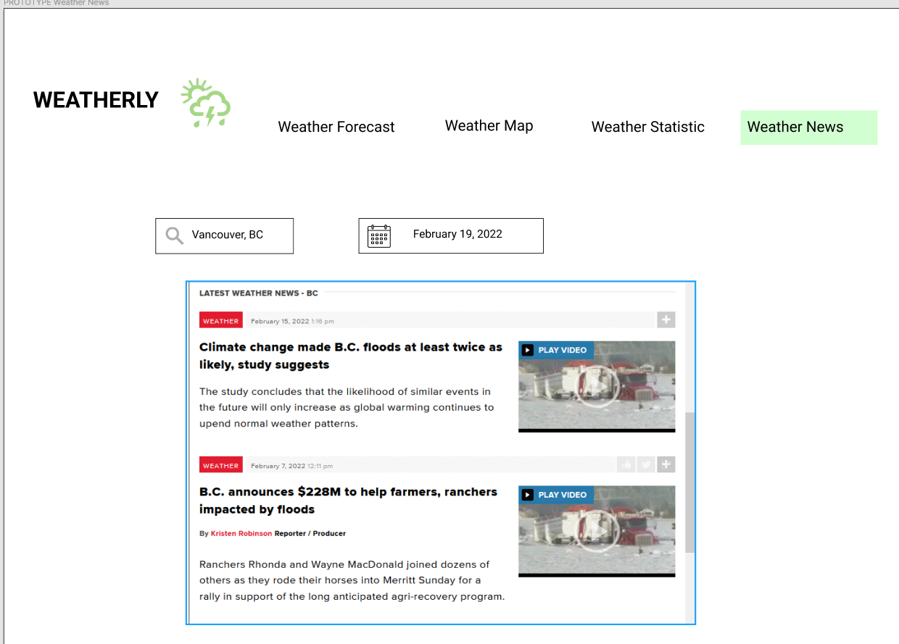

# Group 4 Project Overview
Weatherly is a web application that suits all your needs regarding the weather. It lets the user select a city and display the cities' weather, while showing an option between hourly, daily, and weekly forecasts. These information will range from the high and low temperatures, wind speed, humidity, visibility, and what the temperature feels like. Aside from forecasts, the webpage will also contain weather maps, which displays a map of the surrounding area, color coded according to the temperature, and news regarding the weather.

- SDLC : Prototyping

- Project's Technology Stack : HTML, CSS, JAVASCRIPT, REACTJS

- APIs: 
	1. One call api : https://openweathermap.org/api
		a) minute forecast
		b) hourly forecast
		c) daily forecast 

   2. Weather Maps: https://openweathermap.org/api
      Allows us to display maps of surrounding areas, whcih will be color coded to certain weather conditions/
   
   3. News api: https://newsapi.org/v2/everything?q=tesla&from=2022-01-05&sortBy=publishedAt&apiKey=API_KEY from newapi.org
        a) displays its keyword(from the google map, default:vancouver)
        b) recent news
        c) oldest news from the past 7 days. 

# WBS graph:

# Application Interface Sketch:

