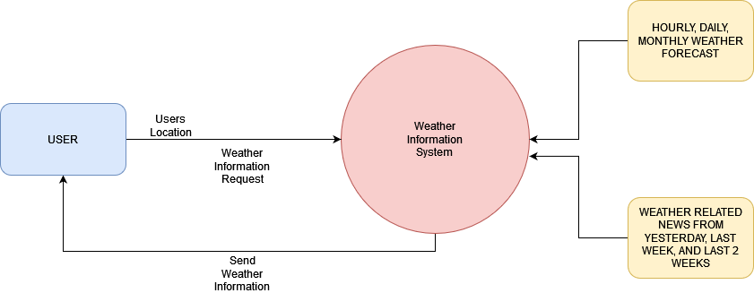

# Group 4 Project Overview
Weatherly is a web application that suits all your needs regarding the weather. It lets the user select a city and display the cities' weather while showing daily, hourly, and current forecasts, accurate to the minute. This information will range from the high and low temperatures, wind speed, visibility, and the weather. Aside from forecasts, the application can also serve as a way to consume your weather reports, as the homepage displays weather related news of the entered city from the previous weeks. All of this information can be accessed in a single click, simply by entering the city name to the field provided. 

The application can be accessed through the following link:
https://group4-weatherly-app.herokuapp.com/

- SDLC : Prototyping
Prototyping is an information-gathering technique useful in seeking user reactions, suggestions, innovations, and revision plans. The main goal of this SDLC is to create a working model that has all the features to allow the users to interact with the system. The specific prototype model we chose is a selected features prototype. This model aims to implement the features one at a time, and the following features will be built on top of the created prototype. Successful prototypes created with this model in mind are not just a mock-up that is used to test its features, but will be incorporated into the final system, reducing the workload of interfacing.

- Project's Technology Stack : HTML, CSS, JAVASCRIPT, NODEJS

- APIs: 
	One Call API: 
	Makes one API call to get current forecasts and historical weather data in a JSON format
		• Minute forecasts for current hour, which includes temperature, weather, wind speed, and visibility
		• Hourly forecast for the next 3 hours, which includes temperature and weather
		• Daily forecast for the three upcoming days, which includes temperature and weather
	
	News API:
	Locate articles and breaking headlines from news sources and blogs across the web
		• Daily news reports, displays news headlines from the previous day
		• Weekly news reports, displays news headlines from one and two weeks prior
	
	Geocoding API:
	Converts addresses represented by a string into geographic coordinates
	
	Heroku:
	Allows the GitHub repository to connect to Heroku and deploy the application
	
- High-Level Data Flow Diagram

