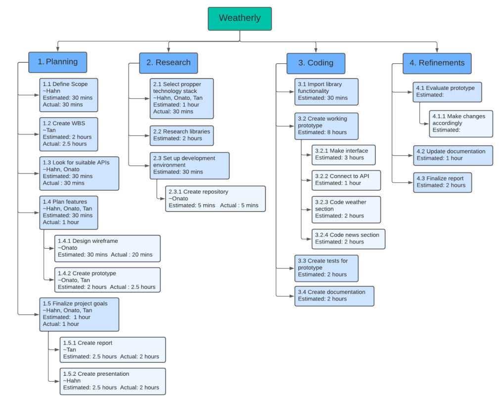

# Group 4 Project Overview

- Project Description : A web application that tells past and expected weather. It also let the user subscribe daily weather updates and updates will
get sent via email or text message.

- SDLC : Prototyping

- Project's Technology Stack : HTML, CSS, JAVASCRIPT, REACTJS

# APIs: : https://openweathermap.org/api
	1. One call api :   
		a) minute forecast
		b) hourly forecast
		c) daily forecast 

	2. Current Weather Data: 
		a) access current weather worldwide
		b) comparing weather in different
		c) showing nearby cities’ weather 

# WBS graph:

# Application Interface Sketch: